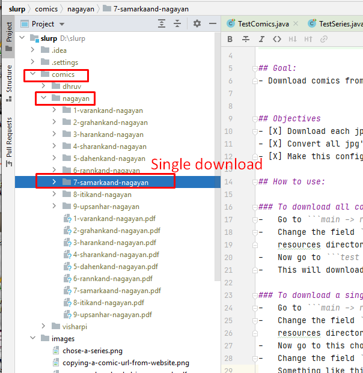

# Slurp


## Goal: 
- Download comics from comicsworld website: https://comicsworld.in/manga/super-commando-dhruv/


## Objectives
- [X] Download each jpg page for each comic into its own repository. 
- [X] Convert all jpg's to pdf files for each comic
- [X] Make this configurable so that if I want to download any super hero comic, I am able to do that (not just for dhruv)

## How to use: 

### To download all comics from a series.
-   Go to ```main -> resources -> application.conf``` file.
-   Change the field ```series="nagayan"``` to something of your choice and something whose config is available in the
    resources directory. Such as say ```visharpi``` whose config is available in resources; say ```series="nagayan"```  
-   Now go to ```test -> java -> slurp -> TestSeries``` and run test ```getAllComicsFromASeriesAsPDFs```.
-   This will download all comics into the directory ```./comics/visharpi/``` as pdfs and images. 

### To download a single comic from a series.
-   Go to ```main -> resources -> application.conf``` file.
-   Change the field ```series="visharpi"``` to something of your choice and something whose config is available in the
    resources directory. Such as say ```nagayan``` whose config is available in resources; say ```series="nagayan"```  
-   Now go to this chosen series config file -> ```main -> resources -> nagayan.conf```.
-   Change the field ```singleComicUrl="whatever url is here..."``` to something of your choice from ```the same series```. 
    Something like this (taken from ther series page below): 
    ```https://comicsworld.in/manga/read-complete-nagayan-series/7-samarkaand-nagayan/```
    
-   Now go to ```test -> java -> slurp -> TestComics``` and run test ```getASingleComicAsPDF```.
-   This will download the comic whose URL you put in that series config into the directory, say ```./comics/nagayan/``` as pdfs and images. 
